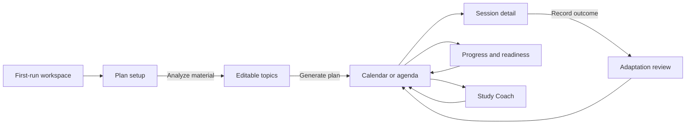
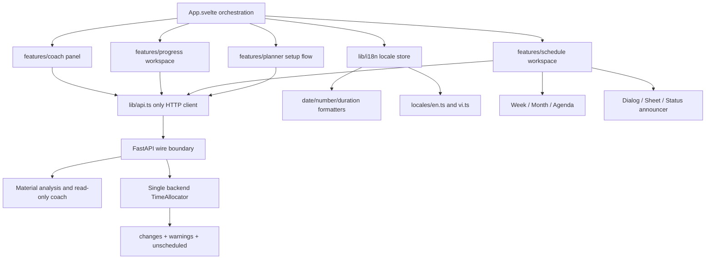
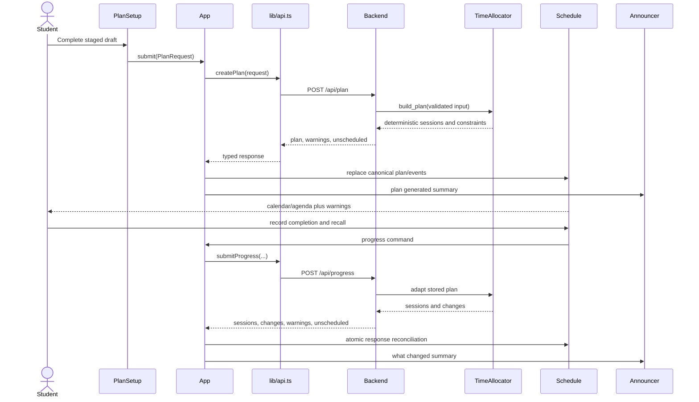

# Design Document: StudyGrid Bilingual UI/UX Redesign

## Document Status

- **Feature**: `bilingual-ui-ux-redesign`
- **Workflow**: design-first
- **Artifacts included**: High-Level Design and Low-Level Design
- **Implementation status**: design only; no application code is changed by this document
- **Primary stack**: Svelte 5, Vite, TypeScript, FastAPI

## Overview

StudyGrid will be redesigned as a calm modern study desk: the schedule and the student's next decision occupy the visual center, while setup, progress, and coaching appear as focused supporting workspaces. The redesign keeps the existing green identity and light/dark themes, replaces mixed-language chrome with a typed Vietnamese/English layer, and uses restrained calendar-grid, connection-line, and progress-dot motifs to explain structure rather than decorate it.

The production flow covers first-run onboarding, staged plan setup, responsive calendar and agenda views, session detail, schedule adaptations, progress, and a unified read-only Study Coach. The design preserves all current scheduling and analysis capabilities while making backend scheduling authority explicit: AI may analyze or explain, explicit user edits may change sessions, and only backend `TimeAllocator` flows may calculate or apply automatic schedule placement.

The redesign is a migration, not a rewrite. Existing HTTP boundaries, anonymous-session persistence, deterministic fallbacks, themes, scheduler invariants, and real-data progress model remain intact. New runtime dependencies are not required.

## Goals

1. Reduce planning anxiety by making one next action obvious at every stage.
2. Provide a complete Vietnamese and English interface with persisted preference and browser-local formatting.
3. Make calendar state, capacity limits, warnings, unscheduled work, and adaptations easy to scan and explain.
4. Preserve create, move, resize, filter, week, month, progress, readiness, and unscheduled workflows with equivalent keyboard paths.
5. Meet WCAG 2.2 AA, including robust dialog focus, status announcements, non-color state cues, zoom, and reduced motion.
6. Keep the hackathon demo deterministic, deployable, and useful when model providers fail.

## Non-Goals

- Replacing the scheduler, persistence model, or anonymous-session architecture.
- Named accounts, cross-device locale synchronization, offline mode, or real-time collaboration.
- Client-side automatic scheduling, AI-authored timestamps, or silent schedule mutation.
- Gamification, streak pressure, confetti, generic gradients, glassmorphism, decorative continuous animation, or a dashboard made of repeated cards.
- Introducing a general-purpose UI, animation, state-management, or i18n framework.

## Design Principles and Visual Direction

### Physical scene and personality

A student opens StudyGrid at a desk between classes or late in an ordinary study day, often already worried about limited time. The interface should feel like an orderly workspace that has made room for the next decision: calm, credible, adaptive, and never judgmental.

### Visual system

- **Composition**: schedule-first workbench, not a promotional landing page. Primary content is left-aligned; supporting panels align to the calendar's rules and time axis.
- **Palette**: preserve the existing StudyGrid green and tinted neutrals. Green denotes primary action/current selection, not decoration. Semantic warning, danger, success, review, and activity colors retain text/icon/pattern companions.
- **Typography**: retain one system sans family for all product UI. Use a fixed compact scale rather than fluid display headlines. Tabular numerals support dates, times, and durations. Body prose stays within 65–75 characters.
- **Shape**: use the current small/medium/large radius hierarchy sparingly. A boundary groups an interactive region; it is not an automatic card. Avoid nested cards.
- **Memorable motif**: a faint calendar-grid field leads from material/topics to ordered schedule rows; short connection lines and progress dots show flow, prerequisites, and adaptations. Motifs are CSS/SVG, `aria-hidden`, static, low contrast, and removed when space is limited.
- **Restraint**: no gradients, glass effects, oversized metrics, decorative numbered scaffolding, or full-saturation inactive states.

### Token extensions

Existing theme values in `web/src/app.css` remain canonical. Add semantic aliases rather than component-local literals.

```typescript
export type Theme = 'light' | 'dark'
export type Density = 'comfortable' | 'compact'

export interface DesignTokens {
  color: {
    page: string
    surface: string
    surfaceSubtle: string
    surfaceElevated: string
    ink: string
    inkSoft: string
    rule: string
    accent: string
    focus: string
    info: string
    success: string
    warning: string
    danger: string
  }
  space: { 1: '4px'; 2: '8px'; 3: '12px'; 4: '16px'; 5: '24px'; 6: '32px' }
  radius: { control: '8px'; panel: '13px'; dialog: '18px' }
  motion: {
    fast: '150ms'
    standard: '200ms'
    slow: '250ms'
    easeOutExpo: 'cubic-bezier(0.16, 1, 0.3, 1)'
  }
  z: { dropdown: 30; sticky: 40; scrim: 50; modal: 60; toast: 70; tooltip: 80 }
}
```

All text/background token pairs must meet 4.5:1 for normal text and 3:1 for large text and meaningful graphical objects. Focus indicators must be at least 2 CSS pixels equivalent, unobscured, and contrast at least 3:1 against adjacent colors.

## Information Architecture and Responsive Layout

### Primary flow



### Responsive structure

| Width | Primary schedule | Navigation/support | Session/create surface |
|---|---|---|---|
| `>= 1200px` | Week grid by default; month available | Collapsible left controls; right context panel only when opened | Non-modal side sheet where feasible |
| `768–1199px` | Week grid with horizontal time canvas; agenda toggle | Compact toolbar; filters in popover/sheet | Side sheet, max 50vw |
| `< 768px` | Agenda/list is primary; month overview optional; week grid not default | Bottom/compact action bar; filters and unscheduled work in sheets | Full-width bottom sheet/dialog |

The mobile agenda is a first-class projection of the same `CalendarEvent[]`, not a reduced feature set. It groups sessions by browser-local date, exposes status and review labels, and supports open/edit/reschedule/delete actions. Month view is retained for overview. Desktop week view retains pointer move/resize; keyboard users and touch users use explicit date/time fields and a reschedule command.

### Empty/landing workspace

The first screen removes repetitive empty panels and marketing-like copy. It contains:

1. A concise heading: what StudyGrid will produce.
2. A three-part explanatory connection line: **materials → available time → adaptive schedule**.
3. One primary CTA, **Create study plan** / **Tạo kế hoạch học**.
4. A static, muted calendar preview that teaches first-pass, review, and unscheduled outcomes without presenting fake user data.
5. Secondary theme, language, privacy, and delete controls in quiet chrome.

Restoration uses the same layout with a schedule-shaped skeleton and `aria-busy`; an error replaces the skeleton with a concrete retry action. There is no duplicate CTA in the header and body.

### Calendar hierarchy

The calendar header orders controls by task: date and **Today**, view selector, filters/search (only if fully implemented), create, then supporting actions. Progress/readiness and Coach are visible but subordinate. Any dead “search”, “add calendar”, or avatar/account control is removed unless its complete behavior, empty/error states, and keyboard interaction are delivered.

## Architecture



### Authority boundary

| Action | May originate in UI? | May choose timestamps? | Required authority |
|---|---:|---:|---|
| Create a manual session | Yes, explicit user fields | User chooses | Existing session API validates |
| Move/resize a session | Yes, explicit pointer/keyboard/form action | User chooses | Existing session API validates |
| Record progress/recall | Yes | No | Backend adaptation through `TimeAllocator` |
| Accept reschedule proposal | Yes | No; accepts backend slots | Backend `TimeAllocator` proposal/apply flow |
| Apply readiness adaptation | Yes | No | Backend health schedule endpoint and `TimeAllocator` |
| Ask Coach for advice | Yes | Never | Read-only AI/fallback response |
| Generate AI schedule preview in browser | No | Never | Prohibited |

The existing `Calendar.svelte` functions that find and apply a client-computed AI move (`findSuggestedMove`, `AiPreview.proposedStart`, `applyAiPreview`) must be removed during migration. Until a scheduler-validated proposal contract exists, Coach presents explanation and suggested explicit next actions only. If such a contract is added later, the backend response must include proposal identity, expiry/version, `changes[]`, warnings, and unscheduled work; applying it must be a separate explicit backend command that revalidates against the current plan.

## Components and Interfaces

Proposed files express ownership; migration may temporarily wrap existing components.

```text
web/src/
  App.svelte                         restore, plan identity, top-level flow only
  app.css                           global themes, semantic tokens, reset
  lib/
    api.ts                          only HTTP access
    types.ts                        backend wire types
    i18n/
      index.ts                      locale state, t(), formatter factory
      keys.ts                       TranslationKey and placeholder argument map
      en.ts                         English catalog
      vi.ts                         Vietnamese catalog
    ui/
      motion.ts                     motion preference and transition presets
      focus.ts                      focus return/initial-focus helpers
      status.ts                     polite/assertive announcement queue
  components/
    ui/
      Button.svelte                 shared states and vocabulary
      Field.svelte                  label, hint, error relationship
      Dialog.svelte                 native dialog semantics and focus contract
      Sheet.svelte                  responsive dialog presentation
      SegmentedControl.svelte
      InlineNotice.svelte
      Skeleton.svelte
      StatusAnnouncer.svelte
    onboarding/
      EmptyWorkspace.svelte
      PlanningExplanation.svelte
    planner/
      PlanSetup.svelte              stage state and submit boundary
      SetupProgress.svelte
      BasicsStep.svelte
      MaterialsStep.svelte
      TopicsStep.svelte
      AvailabilityStep.svelte
      CommitmentsStep.svelte
      ReviewStep.svelte
      MaterialAnalyzer.svelte
      TopicEditor.svelte
    schedule/
      ScheduleWorkspace.svelte
      ScheduleToolbar.svelte
      WeekView.svelte
      MonthView.svelte
      AgendaView.svelte
      EventBlock.svelte
      FilterPanel.svelte
      UnscheduledPanel.svelte
      AdaptationSummary.svelte
      SessionSheet.svelte
      CreateSessionDialog.svelte
    coach/
      CoachPanel.svelte             replaces duplicate AI/StudyCoach experiences
      CoachTranscript.svelte
    progress/
      ProgressWorkspace.svelte
      ActivityChart.svelte
      ActivityForm.svelte
      ReadinessPanel.svelte
```

### Responsibility summary

- **`App.svelte`** owns restored plan state, top-level API operations, current surface, and cross-feature response reconciliation. It does not format copy or implement calendar interactions.
- **`PlanSetup.svelte`** owns a single `PlanDraft` through six staged sections, step validity, draft preservation, and final conversion to `PlanRequest`.
- **Schedule views** are pure renderers over a common view model and dispatch semantic commands. They never call HTTP or calculate automatic placement.
- **`AdaptationSummary.svelte`** is the canonical renderer for `changes[]`, `warnings[]`, and `unscheduled[]` after progress, reschedule, or readiness operations.
- **`CoachPanel.svelte`** is the only coach UI. It can pass selected session context but exposes no mutation command from a prose answer.
- **`lib/i18n`** owns UI strings and browser-local presentation. Backend-provided free text remains displayed as data unless a stable code is available for local translation.
- **UI primitives** centralize focus, keyboard, loading, disabled, error, and motion behavior so dialogs do not drift.

## State and Data Flow



### Application state

```typescript
export type Locale = 'vi' | 'en'
export type AppSurface = 'schedule' | 'progress'
export type SetupStep =
  | 'basics'
  | 'materials'
  | 'topics'
  | 'availability'
  | 'commitments'
  | 'review'

export interface AppState {
  locale: Locale
  theme: Theme
  plan: PlanResponse | null
  events: CalendarEvent[]
  health: HealthDashboard | null
  latestAdaptation: AdaptationResult | null
  selectedSessionId: string | null
  surface: AppSurface
  overlay: OverlayState
  restore: AsyncState
}

export type AsyncState =
  | { status: 'idle' }
  | { status: 'loading'; operation: string }
  | { status: 'success'; messageKey?: TranslationKey }
  | { status: 'error'; error: UiError }

export type OverlayState =
  | { kind: 'none' }
  | { kind: 'setup'; returnFocusId: string }
  | { kind: 'create-session'; initialStart?: string; returnFocusId: string }
  | { kind: 'session'; sessionId: string; returnFocusId: string }
  | { kind: 'reschedule'; proposal: RescheduleProposal; returnFocusId: string }
  | { kind: 'coach'; sessionId?: string; returnFocusId: string }

export interface AdaptationResult {
  trigger: 'progress' | 'reschedule' | 'readiness'
  changes: PlanChange[]
  warnings: string[]
  unscheduled: string[]
  receivedAt: number
}
```

Response reconciliation is atomic: on a successful adapting command, update plan sessions, calendar events, `changes[]`, warnings, and unscheduled work as one state transition before announcing completion. On failure, retain the prior canonical schedule and return the moved/edited control to its prior visual state.

## Typed Internationalization

### Locale selection and persistence

- Initial locale resolution: valid `localStorage['studygrid-locale']` → first supported `navigator.languages` value → Vietnamese fallback.
- The language switch shows language names in their own language: **Tiếng Việt** and **English**.
- Selection persists locally and updates `<html lang>`, catalogs, accessible names, date/number/duration formatters, and new UI messages synchronously.
- The setting needs no backend dependency because sessions are anonymous and browser-scoped. Cross-device preference is a non-goal.
- Invalid/corrupt stored values are ignored and replaced with a supported locale.

```typescript
export const supportedLocales = ['vi', 'en'] as const
export type Locale = (typeof supportedLocales)[number]

export interface TranslationArgs {
  'setup.progress': { current: number; total: number; step: string }
  'calendar.moreEvents': { count: number }
  'plan.unscheduledCount': { count: number }
  'status.planGenerated': { sessions: number; unscheduled: number }
  'status.scheduleChanged': { changed: number; unscheduled: number }
  'duration.hoursMinutes': { hours: number; minutes: number }
}

export type TranslationKey =
  | 'app.skipToSchedule'
  | 'nav.createPlan'
  | 'nav.language'
  | 'setup.progress'
  | 'calendar.today'
  | 'calendar.week'
  | 'calendar.month'
  | 'calendar.agenda'
  | 'calendar.moreEvents'
  | 'session.status.planned'
  | 'session.status.completed'
  | 'session.status.partial'
  | 'session.status.notCompleted'
  | 'plan.unscheduledCount'
  | 'status.planGenerated'
  | 'status.scheduleChanged'
  | 'duration.hoursMinutes'
  // exhaustive union generated/maintained from the canonical English shape

export type Catalog = {
  [K in TranslationKey]:
    K extends keyof TranslationArgs
      ? (args: TranslationArgs[K]) => string
      : string
}

export interface I18n {
  locale: Locale
  t<K extends TranslationKey>(key: K, ...args: K extends keyof TranslationArgs ? [TranslationArgs[K]] : []): string
  date(value: Date | string, options?: Intl.DateTimeFormatOptions): string
  number(value: number, options?: Intl.NumberFormatOptions): string
  duration(minutes: number): string
}
```

### Key organization

Keys are semantic and feature-scoped, not English sentences:

```text
app.*                  skip links, global failures, privacy
nav.*                  theme, language, surfaces
onboarding.*           first-run explanation and CTA
setup.basics.*
setup.materials.*
setup.topics.*
setup.availability.*
setup.commitments.*
setup.review.*
calendar.*
session.*
adaptation.*
progress.*
coach.*
status.*               live-region messages
validation.*
```

Both catalogs must satisfy `Catalog`; missing and extra keys fail TypeScript checking. Plurals use `Intl.PluralRules` or catalog functions, not string concatenation. Dates and numbers use `Intl` with the active locale and browser timezone. Timezone display uses `Intl.DateTimeFormat().resolvedOptions().timeZone` or a localized “Local time” label; `GMT+07` is prohibited.

Backend option labels currently arrive in English (`ReasonOption`, activity categories). For this migration, map stable enum values to local catalog keys and use backend labels only as a forward-compatible fallback. Backend summaries, rationale, warnings, and `PlanChange.why` remain authoritative free text; a follow-up API evolution should return stable message codes plus parameters if fully localized backend prose is required. The UI must never claim such free text is translated when it is not.

## Plan Setup Design

### Progressive stages

1. **Basics**: strategy, plan start, daily scheduling window.
2. **Materials**: subjects, exam dates, priorities, and file/URL/text inputs. Each analyzer shows loading, source (`ai` or deterministic fallback), truncation, success, and retryable failure.
3. **Topics**: editable extracted/manual topics, difficulty, estimate, studied state, and dependencies when supported. Analysis never locks editing.
4. **Availability**: session preset/custom length, derived 10% short break, long break, and daily hours with derived weekly capacity.
5. **Commitments**: recurring fixed blocks with day/start/end/label validation.
6. **Review**: concise summary of subjects, capacity, commitments, known unusable short days, and final **Generate study plan** action.

Desktop uses a focused setup workspace or wide sheet with persistent step navigation and summary. Mobile uses a full-screen dialog with sticky Back/Continue footer. Only the current stage and compact completed-stage summary are shown; all draft data remains mounted in state. Users may navigate backward without loss.

### Validation and fallback

```typescript
export interface StepValidation {
  valid: boolean
  issues: ValidationIssue[]
  firstInvalidFieldId?: string
}

export interface ValidationIssue {
  fieldId: string
  key: TranslationKey
  severity: 'error' | 'warning'
}

export interface MaterialAnalysisState {
  input: { kind: 'file'; file: File } | { kind: 'url'; url: string } | { kind: 'text'; text: string } | null
  status: 'idle' | 'analyzing' | 'success' | 'error'
  source: 'ai' | 'fallback' | null
  topics: Topic[]
  truncated: boolean
  error?: UiError
}
```

- Continue validates the current stage, focuses the first invalid control, and links errors through `aria-describedby`.
- Final submit performs native constraint checks and full cross-stage validation.
- `earliest < latest`, commitment `start < end`, valid URL/file constraints, subject/topic requirements, priority ranges, duration ranges, and exam date constraints receive specific messages.
- A non-zero day shorter than the selected session duration is a warning and excluded from displayed schedulable capacity; it is not silently counted.
- Material provider failure falls through to the existing deterministic backend source and displays the actual `source`. If both paths fail, preserve input and existing topics and offer retry/manual entry.
- No sample course is submitted as user data.

## Calendar, Agenda, and Session Interaction

### Common view model

```typescript
export interface ScheduleViewModel {
  anchorDate: string
  timezone: string
  view: 'week' | 'month' | 'agenda'
  events: CalendarEvent[]
  visibleSubjects: Set<string>
  unscheduled: string[]
  readiness: ReadinessAssessment | null
  latestAdaptation: AdaptationResult | null
}

export type ScheduleCommand =
  | { type: 'select'; sessionId: string; triggerId: string }
  | { type: 'create'; start?: string; triggerId: string }
  | { type: 'moveExplicitly'; sessionId: string; start: string; end: string }
  | { type: 'resizeExplicitly'; sessionId: string; start: string; end: string }
  | { type: 'filter'; visibleSubjects: string[] }
  | { type: 'navigate'; anchorDate: string }
  | { type: 'changeView'; view: 'week' | 'month' | 'agenda' }
```

### Keyboard-equivalent interactions

- All event blocks are buttons with topic, subject, local start/end, review/pass type, and completion state in their accessible name.
- Selecting an event opens the session sheet. **Edit time** exposes local start/end fields; saving calls the same update command as pointer move/resize. This is the required keyboard/touch equivalent.
- Calendar navigation buttons have explicit labels. View selection is a segmented control with arrow-key movement and correct `aria-pressed`/radio semantics.
- Filters are labeled checkboxes. **Show all** restores all subjects. Hidden events remain in canonical data.
- Empty time creation is never available only by double-click. A visible **Create session** action accepts an optional prefilled date/time.
- Month “more” controls open that date's agenda; they are not inert text.
- Unscheduled items expose why they did not fit. They are never draggable into a slot unless a backend-supported explicit action is added.
- Pointer drag uses a visible draft; API failure restores original position and announces failure. Successful manual movement announces the new local time.

### State encoding

Completion, review, rescheduled, readiness, and warning states use a combination of label, icon/shape, border/pattern, and color. For example: planned uses an open dot + “Planned”; completed uses check + “Completed”; partial uses half-filled dot + “Partial”; missed/cancelled uses cross + text; review uses a loop icon and “Review N”. Strikethrough is supplementary only.

## Unified Study Coach

The existing separate `StudyCoach.svelte` and calendar AI planner panel become one responsive Coach panel with a single transcript and composer. It receives the current plan and optional selected session through the existing `/api/chat` boundary.

- The Coach explains the next session, remaining work, rationale, capacity, and recovery options.
- It labels response source as AI or deterministic fallback without implying different authority.
- It answers in the user's active language; the request may include locale only if backend language adherence proves unreliable. Such an API change is optional and must remain in `api.ts`.
- Plan text is treated as untrusted data and rendered as text, never HTML.
- It never says it changed the calendar and has no **Apply** action for prose.
- Suggested questions are localized client UI; server suggestions are displayed as returned unless the contract evolves to suggestion codes.
- A future scheduler proposal is rendered outside the transcript as a typed `SchedulerProposal`, with explicit review and apply steps. A stale/version-mismatched proposal fails closed and refreshes the plan.

```typescript
export interface SchedulerProposal {
  proposalId: string
  planId: string
  planVersion: string
  expiresAt: string
  changes: PlanChange[]
  warnings: string[]
  unscheduled: string[]
}
```

This interface is a future backend contract, not permission to synthesize a proposal in the frontend.

## Adaptations and Explanation

After progress, cancellation, reschedule, or readiness application, focus moves to an adaptation summary heading (or the summary is announced and remains adjacent to the schedule). The summary presents:

1. **What changed**: moved/added/kept/blocked/cancelled rows from `changes[]`.
2. **Why**: `PlanChange.why`, plus local before/after timestamps when present.
3. **Could not fit**: warnings and unscheduled work, with count and next action.
4. **Return to schedule**: highlights affected sessions without auto-scrolling under reduced motion.

An empty `changes[]` is explicit: “Your schedule did not need to change.” Warnings are not success messages. Blocked and unscheduled work remains visible until resolved or superseded by a later canonical response.

## Progress and Readiness

Progress remains real-data-first. At desktop, chart and category totals form one analytical region rather than nested cards. At mobile, an accessible summary list precedes the horizontally scrollable or simplified chart. Every graphical value is available in text and has localized labels/durations.

- Loading uses a static schedule/chart skeleton with `aria-busy` and one status announcement.
- Empty state explains that completed study sessions sync automatically and offers **Log activity** as the relevant action.
- Low-confidence insights say more data is needed; the UI does not lower backend thresholds or manufacture patterns.
- Activity source and cancellation reason use local enum labels where stable values exist.
- Readiness is general wellness guidance, never diagnosis; schedule changes require explicit confirmation and backend apply.
- Edit/delete success updates focus predictably and is announced.

## Dialogs, Sheets, Focus, and Announcements

`<dialog>.showModal()` is preferred for modal behavior. Desktop side sheets and mobile bottom/full-screen sheets share modal semantics when they block the page.

### Overlay contract

1. Capture the invoking element or stable trigger ID before opening.
2. Set an accessible name and optional description.
3. On open, focus the heading for explanatory dialogs or first invalid/primary field for forms.
4. Keep focus inside; native dialog behavior is used where reliable, with first/last sentinels only as a tested fallback.
5. Escape closes non-destructive overlays. During an irreversible in-flight command, Escape may be temporarily ignored only with a status message.
6. Close by Escape, close button, cancel, or successful completion returns focus to the invoking element; if it no longer exists, focus the nearest stable schedule heading.
7. Background content is inert only while a modal overlay is open. Nested modals are prohibited.
8. Destructive confirmation names the object and uses explicit cancel/confirm controls; blur is not a confirmation-state reset mechanism.

```typescript
export interface DialogController {
  open(options: {
    trigger: HTMLElement
    initialFocus?: 'heading' | string
    returnFallback: string
  }): void
  close(reason: 'escape' | 'cancel' | 'success' | 'dismiss'): Promise<void>
}

export interface Announcement {
  politeness: 'polite' | 'assertive'
  key: TranslationKey
  args?: Record<string, string | number>
  dedupeKey?: string
}
```

Use a persistent polite live region for loading/success and an assertive region for blocking errors. Avoid re-announcing each skeleton row, transcript token, or drag frame. Dynamic changes announce counts and the most important next action.

## Motion System

Motion occurs only after a state change and lasts 150–250ms with exponential ease-out:

| Transition | Duration | Properties | Meaning |
|---|---:|---|---|
| Dialog/sheet open-close | 200ms | opacity + transform | Establish layer and origin |
| Setup step change | 180ms | opacity + small horizontal transform | Preserve direction/progress |
| Plan generation complete | 250ms | opacity + clip/reveal of schedule region | Replace setup with generated result |
| Session state update | 180ms | background/border/opacity | Confirm status change |
| Adaptation rows | 200ms | opacity + transform, one group only | Identify changed schedule rows |
| Panel expansion | 200ms | transform/opacity; no width animation if it causes layout churn | Reveal context |
| Loading skeleton | none or restrained opacity pulse | opacity only | Indicate pending content |

No animation loops after content is ready, no parallax, no hover choreography, and no celebratory effects. Do not animate grid columns, height, top, or other layout properties during calendar operations; use a transform-based draft and commit final layout.

Under `prefers-reduced-motion: reduce`, transitions become instant or a <=50ms opacity change, smooth scrolling is disabled, progress skeletons are static, and schedule highlighting uses outline/background only. Behavior, focus, and announcements remain identical.

## Error Handling

Errors use actionable plain language, are localized when generated by the client, and retain safe backend detail without exposing stack traces. Failed optimistic edits roll back to canonical data; setup and analysis failures preserve user input; all blocking errors receive assertive announcements and a visible retry or correction path.

### Error, Loading, Empty, and Success States

| Surface | Loading | Empty | Error | Success |
|---|---|---|---|---|
| Restore | Schedule-shaped skeleton | First-run workspace | Retry restore; preserve setup CTA | Render canonical plan |
| Material analysis | Inline analyzer skeleton/progress label | Select one input method | Specific retry/manual entry; preserve draft/topics | Extracted count, source, truncation; topics editable |
| Plan generation | Disable duplicate submit; staged status text | N/A | Stay on review; focus summary; preserve complete draft | Show calendar, warnings, unscheduled count |
| Calendar | Keep existing data during background refresh | Honest no-session/filtered state | Roll back optimistic edit; retry | Announce new/moved time |
| Adaptation | Mark command busy; no fake movement | Explicit no-change state | Retain old schedule | Show `changes[]`, warnings, unscheduled work |
| Coach | One pending response row | Suggested plan questions | Retry without losing draft/history | Source-labeled response; no mutation claim |
| Progress | Static skeleton | Explain sync + log activity | Inline retry | Announce create/edit/delete |

Errors use actionable plain language, are localized when generated by the client, and retain backend detail without exposing stack traces. Controls identify the operation in progress instead of using generic “Loading…”. Success toasts are reserved for background or context-losing operations; inline confirmation is preferred.

## Data Models

The redesign preserves existing `PlanRequest`, `PlanResponse`, `CalendarEvent`, `ProgressResponse`, `RescheduleProposal`, `HealthDashboard`, activity, and coach wire shapes. Frontend types remain mirrors of `app/api/schemas.py`. The additional UI-only models are `AppState`, `OverlayState`, `AdaptationResult`, `PlanDraft`, `ScheduleViewModel`, `MaterialAnalysisState`, and the typed locale catalog interfaces defined above; none are serialized unless explicitly converted to an existing API request.

## API Impact

No backend work is required for core bilingual UI because catalogs and formatting are browser-local. Two limitations are documented rather than hidden:

1. Backend free-text rationale, summaries, warnings, changes, and dynamic coach suggestions are not structurally localizable today.
2. The current coach contract can return bilingual prose but does not accept an explicit locale.

If production localization requires complete backend prose translation, evolve responses to `{ code, params, fallback }` and optionally add `locale: 'vi' | 'en'` to `CoachRequest`. This is a separate contract migration with FastAPI and TypeScript changes in lockstep. Do not duplicate or parse English sentences in the UI.

The backend must not add a scheduling proposal endpoint unless it delegates placement and revalidation to the plan's single `TimeAllocator`. Components continue to access all endpoints only through `web/src/lib/api.ts`.

## Security and Privacy

- Render user material, topic names, labels, rationale, and coach content as escaped text. No raw HTML injection.
- File/URL analysis keeps existing bounded extraction and server validation; the UI does not fetch public URLs directly.
- Locale/theme persistence stores only preference strings, not study content.
- Anonymous-session cookie, owner scoping, same-origin relative `/api`, and deletion controls remain unchanged.
- Destructive actions require explicit confirmation and clearly state scope.
- Coach input is untrusted; provider output cannot create timestamps or direct UI execution.
- Do not expose API keys, provider prompts, health data internals, or stack traces in UI errors.

## Performance and Deployment

- Add no runtime dependency for i18n, focus, or motion; native `Intl`, Svelte state, CSS, and `<dialog>` are sufficient.
- Keep catalogs as static TypeScript objects. At current two-locale scale both may ship in the main bundle; if measured growth is material, dynamically import the non-default catalog without delaying initial controls.
- CSS/SVG motifs use no raster assets, webfonts, filters, or continuous compositing.
- Split large existing components along the feature boundaries above to reduce rerender scope; memoize/group event projections by local date and subject.
- Avoid repeated `eventsForDay` filtering inside nested month rendering by precomputing a `Map<LocalDate, CalendarEvent[]>` once per event/filter change.
- Keep progress chart DOM bounded and avoid per-frame state updates during drag. Pointer movement updates only the active event draft.
- Preserve production shape: Vite builds `web/dist`, FastAPI serves it on the same origin, and API URLs remain relative.
- Measure bundle size before/after. Target: redesign-specific code adds <=30 KiB gzip excluding catalogs, and each locale catalog <=15 KiB gzip. A justified exceedance requires measurement and cut-list review.

## Dependencies

Required: existing Svelte 5, Vite, TypeScript, FastAPI, native browser APIs, and existing calendar/Temporal packages. Existing Playwright and `@axe-core/playwright` support validation.

No new package is proposed. If a package later becomes necessary, first document why native/current tooling is insufficient, verify an explicit MIT/Apache-2.0/BSD license, pin an exact version, and assess production bundle impact. Do not copy from unlicensed repositories.

## Algorithmic Design and Formal Specifications

The following TypeScript signatures define behavior, not an implementation requirement to copy verbatim.

### Locale resolution

```typescript
function resolveLocale(
  stored: string | null,
  preferredLanguages: readonly string[],
  fallback: Locale = 'vi',
): Locale
```

**Preconditions**
- `preferredLanguages` may be empty and may contain malformed/unsupported tags.
- `stored` is untrusted browser storage.

**Postconditions**
- Returns exactly `'vi'` or `'en'`.
- Returns `stored` when it is a supported exact locale.
- Otherwise returns the first supported base language from `preferredLanguages`.
- Otherwise returns `fallback`.
- Does not mutate arguments or access network/backend state.

**Loop invariant**
- Before examining preferred language `i`, no element in `[0, i)` resolves to a supported locale.

```typescript
function resolveLocale(stored, preferredLanguages, fallback = 'vi') {
  if (stored === 'vi' || stored === 'en') return stored
  for (const tag of preferredLanguages) {
    // Invariant: no earlier tag has a supported base locale.
    const base = tag.toLowerCase().split('-')[0]
    if (base === 'vi' || base === 'en') return base
  }
  return fallback
}
```

### Setup stage validation

```typescript
function validateSetupStep(step: SetupStep, draft: PlanDraft): StepValidation
function toPlanRequest(draft: PlanDraft): PlanRequest
```

**Preconditions**
- `draft` is structurally initialized and may contain incomplete user input.
- `toPlanRequest` is called only after every setup stage validates.

**Postconditions**
- Validation is deterministic and side-effect free.
- Every error references an existing field ID in the rendered stage.
- `toPlanRequest` trims names, removes only intentionally blank topic rows, converts daily hours to integer minutes once, preserves all nonblank material-derived edits and commitments, and sets no timezone offset.
- Derived weekly capacity is never serialized as an independent scheduling constraint.

**Loop invariants**
- While validating subjects, every subject before index `i` has a nonblank name, valid priority/exam date, and at least one valid topic.
- While converting weekdays, converted entries before index `i` equal rounded input hours × 60 and remain keyed 0–6.

### Event projection

```typescript
function projectEvents(
  events: readonly CalendarEvent[],
  visibleSubjects: ReadonlySet<string>,
  locale: Locale,
  timezone: string,
): ReadonlyMap<string, readonly ScheduleItem[]>
```

**Preconditions**
- Each event has a stable unique ID and valid same-day `start < end` contract from the backend.
- `timezone` is the browser-resolved IANA zone supported by `Intl`.

**Postconditions**
- Includes each event whose subject is visible exactly once and excludes every hidden-subject event.
- Groups by local calendar date in `timezone` and sorts within each group by start, then stable ID.
- Does not mutate events or infer new timestamps.
- Week, month, and agenda consume the same projected identity/order.

**Loop invariant**
- After processing `i` events, each visible event in `[0, i)` occurs in exactly one correct date bucket and no hidden event occurs in any bucket.

### Atomic adaptation reconciliation

```typescript
function reconcileAdaptation<T extends ProgressResponse | RescheduleResponse | HealthScheduleApplyResponse>(
  previous: AppState,
  response: T,
  fetchedEvents: readonly CalendarEvent[],
  trigger: AdaptationResult['trigger'],
): AppState
```

**Preconditions**
- `response` and `fetchedEvents` belong to `previous.plan.plan_id` and one completed request.
- Backend validation and scheduler execution succeeded.

**Postconditions**
- Plan sessions, rendered events, changes, warnings, and unscheduled work all represent the same successful response cycle.
- Existing theme, locale, surface preference, and unrelated draft state are preserved.
- No schedule timestamp is derived from coach prose or client heuristics.
- The returned state is a new state value; `previous` is unchanged.

**Loop invariant**
- While indexing changed session IDs, every processed change points either to a session in the new canonical response or is a documented cancelled/blocked change with nullable session ID.

### Explicit session edit

```typescript
async function updateExplicitSession(command: Extract<ScheduleCommand,
  { type: 'moveExplicitly' | 'resizeExplicitly' }
>): Promise<Result<CalendarEvent, UiError>>
```

**Preconditions**
- The user explicitly supplied or manipulated `start` and `end`.
- The session is editable and `start < end` on one local date.

**Postconditions**
- Calls `updateSession` only through `lib/api.ts`.
- On success, replaces only the matching canonical event and announces its formatted local time.
- On failure, rendered event data equals pre-command data and an actionable error is announced.
- Never searches for a slot or moves any other event.

**Loop invariants**: N/A.

### Modal focus restoration

```typescript
async function closeOverlay(
  state: OverlayState,
  reason: 'escape' | 'cancel' | 'success' | 'dismiss',
): Promise<void>
```

**Preconditions**
- `state.kind !== 'none'` and records a stable return target.

**Postconditions**
- Overlay is no longer modal and background is no longer inert.
- Focus returns to the live trigger when present, otherwise to the schedule/setup fallback heading.
- No focus remains in a hidden/disconnected subtree.
- Escape does not execute a destructive command.

**Loop invariants**: N/A.

## Correctness Properties

These are universal properties suitable for property-based testing and trace to the derived acceptance criteria in `requirements.md`. Generated strings include Vietnamese diacritics, long English labels, empty/whitespace input, unsupported locale tags, DST boundaries where the platform supports them, and event sets with varied subjects/statuses.

### Property 1: Locale totality and precedence
**Validates: Requirements 1.1**

For all storage strings and language lists, `resolveLocale` returns a supported locale; valid stored preference always wins, and without one the first supported browser language wins.

### Property 2: Catalog parity
**Validates: Requirements 1.2**

For every `TranslationKey`, both locale catalogs contain exactly one value of the required string/function shape; formatting with valid arguments never yields `undefined`, a missing-key marker, or the untranslated key.

### Property 3: Locale round trip
**Validates: Requirements 1.3**

For every supported locale, selecting it, persisting it, and resolving after reload yields the same locale and matching `<html lang>`.

### Property 4: Browser-local time consistency
**Validates: Requirements 1.4**

For every valid event and supported browser timezone, every active view and accessible label formats the same instant/local contract consistently; no rendered timezone label is hard-coded `GMT+07`.

### Property 5: Projection conservation
**Validates: Requirements 3.1**

For every event list and visible-subject set, projected views contain each visible event exactly once and no hidden event; changing calendar view does not modify event data.

### Property 6: Stable ordering
**Validates: Requirements 3.2**

For every permutation of the same events, projection ordering is identical by local start then stable ID.

### Property 7: Setup preservation
**Validates: Requirements 2.1**

For every valid draft, any sequence of forward/back stage navigation preserves all user-entered values and material-analysis results until explicit removal/reset.

### Property 8: Request conversion
**Validates: Requirements 2.2**

For every valid daily-hours map, serialized weekday minutes equal the defined conversion and weekly display total equals their sum; unusable short days are flagged and not represented as usable full-session capacity.

### Property 9: Analysis transparency
**Validates: Requirements 2.3**

For every successful material response, rendered source equals response source and all returned topics remain editable; fallback success is never rendered as AI success.

### Property 10: No client auto-scheduling
**Validates: Requirements 4.1**

For every coach response and calendar state, receiving/rendering the response leaves all event timestamps and identities unchanged. Concurrent explicit manual update commands or scheduler-backed API responses take priority and may change them.

### Property 11: Adaptation completeness
**Validates: Requirements 4.2**

For every successful adaptation response, the next UI state exposes all `changes`, warnings, and unscheduled entries without omission or invented rows, including the empty-change case.

### Property 12: Failed edit rollback
**Validates: Requirements 3.3**

For every operation that modifies event presentation or state and every resulting failure—including explicit move/resize and implicit layout/conflict operations—canonical and rendered events after failure equal their pre-command values.

### Property 13: Filter reversibility
**Validates: Requirements 3.4**

For every event set and sequence of subject toggles, toggling a subject twice restores the same visible event IDs/order and never changes canonical events.

### Property 14: State meaning without color
**Validates: Requirements 5.1**

For every session status, generated accessible text and a visible text or non-color marker uniquely identify the status in both locales.

### Property 15: Modal focus safety
**Validates: Requirements 5.2**

For every overlay open/close path (Escape, Cancel, Success, Close), focus is inside while open and returns to the trigger or documented fallback after close; the background is inert only while modal.

### Property 16: Reduced-motion equivalence
**Validates: Requirements 5.3**

For every state-changing workflow, reduced-motion and default-motion modes reach equivalent final data, focus, and announcements; reduced mode has no continuous animation or smooth scrolling.

### Property 17: Optimistic isolation
**Validates: Requirements 3.5**

For every explicit edit, at most the target event has a draft transform before confirmation; unrelated events and persisted state are unchanged until a successful response.

### Property 18: Deterministic UI derivation
**Validates: Requirements 3.6**

Given equal canonical API data, locale, timezone, theme, filters, and anchor date, schedule view models and adaptation summaries are deeply equal.

### Property 19: Responsive functional parity
**Validates: Requirements 3.7**

For every core command available in desktop week view, phone agenda/session surfaces expose a keyboard/touch command with the same API intent and outcome.

### Property 20: Unsafe content rendering
**Validates: Requirements 6.1**

For every user/backend string containing HTML/script-like text, rendering produces text content and never executable DOM or event handlers; violation of either condition fails the property.

## Testing Strategy

### Unit and type validation

- `svelte-check` verifies catalog parity, typed translation calls, props, and API response reconciliation.
- Unit-test pure locale resolution, formatters, setup validation/conversion, event projection, change grouping, and status view models.
- Add property-based tests with a permissively licensed library only after license/version review. Preferred candidates: `fast-check` for TypeScript UI derivations and existing Python property tooling if already approved; otherwise implement bounded deterministic generators for the first migration without adding a dependency.
- Keep existing backend scheduler smoke tests unchanged; the redesign must not weaken overlap, commitment, deadline, break, deterministic fallback, or `TimeAllocator` invariants.

### Playwright flows

Run each critical flow in both `vi` and `en`, light and dark where visual semantics differ:

1. First-run explanation has one primary CTA; locale selection persists across reload.
2. Setup Back/Continue preserves file/text/URL input metadata, editable topics, availability, custom durations, and commitments; invalid fields focus correctly.
3. AI and deterministic material sources are represented accurately.
4. Plan generation renders warning/unscheduled outcomes and focuses/announces the schedule.
5. Week, month, and agenda preserve event IDs; filters are reversible.
6. Pointer move/resize and form-based keyboard equivalents call the same API intent; mocked failure rolls back.
7. Session completion/partial/missed flows expose all returned adaptations and reschedule choices.
8. Coach answer leaves event timestamps unchanged; no apply action exists for prose.
9. Progress chart has an equivalent text summary and log/edit/delete focus behavior.
10. Every dialog/sheet supports initial focus, Tab containment, Shift+Tab, Escape, close/cancel/success return focus, and background inertness.
11. Mobile at 320/390px uses agenda primary and has no page-level horizontal overflow; tablet and desktop schedule controls remain operable.
12. Browser zoom at 200% and text spacing overrides do not hide controls or content.
13. Reduced-motion emulation produces no continuous animation and preserves final focus/status.
14. Corrupt localStorage locale/theme values recover safely.

### Axe and semantic checks

Use `@axe-core/playwright` for WCAG A/AA rules on first-run, each setup stage, calendar/agenda, session/create/reschedule dialogs, Coach, adaptation summary, Progress, and readiness. Axe is necessary but not sufficient: manually/test-programmatically verify focus order, accessible names, live-region deduplication, target size, drag alternatives, non-color cues, and focus-not-obscured requirements from WCAG 2.2.

### Visual regression

Capture stable screenshots with deterministic fixture data and animations disabled for:

- Empty workspace, setup stages, generated week/month/agenda, session sheet, adaptation summary, Coach, and Progress.
- Vietnamese and English at 390×844, 768×1024, 1280×800, and 1440×1000.
- Light, dark, loading, error, warning/unscheduled, long text, and reduced-motion variants.

Mask only truly nondeterministic current-time indicators. Do not mask overflow, focus rings, timestamps, or translated copy. Review calendar density, truncation, motif restraint, contrast, and dialog clipping.

### Performance checks

- Compare `vite build` asset gzip sizes to baseline and enforce the redesign budgets above.
- Use browser traces for 200 representative events: navigation/filter changes should avoid long tasks over 50ms on the target demo laptop; pointer drag should remain responsive without recomputing all buckets per frame.
- Verify no new network request is made solely to translate UI chrome.

## Migration Plan

### Phase 0 — Safety and baseline (must ship first)

- Add deterministic API fixtures and screenshot baselines for current primary flows.
- Remove/disable client-side AI move calculation and apply behavior immediately; retain read-only coach explanation.
- Inventory all visible strings, controls, dialog paths, status encodings, and dead controls.
- Record baseline build size and critical Playwright/Axe results.

### Phase 1 — Foundations

- Add semantic tokens, typed `vi`/`en` catalogs, locale persistence, browser-local formatters, `html[lang]`, shared status announcer, and dialog/sheet focus contract.
- Migrate shared controls and top-level client errors first.
- Replace hard-coded timezone labels and component-local locale formatting.

### Phase 2 — Activation and setup

- Replace repetitive empty layout with the single-CTA planning explanation.
- Refactor `IntakeForm` into staged setup while preserving one `PlanDraft` and all material/availability/commitment features.
- Add review summary, focused validation, analysis source/truncation states, and draft-preservation tests.

### Phase 3 — Schedule workspace

- Split the calendar into toolbar and view modules; remove dead search/add-calendar/avatar controls or finish only those explicitly retained.
- Add mobile-first agenda, complete month “more” behavior, browser-local timezone display, common event projection, and explicit keyboard/touch edit paths.
- Add non-color status vocabulary and robust rollback/status feedback.

### Phase 4 — Adaptation, session, and Coach

- Consolidate session/create/reschedule surfaces on shared sheet/dialog primitives.
- Add canonical adaptation summary for `changes[]`, warnings, unscheduled work, and why/before/after data.
- Merge AI planner and Study Coach into one read-only panel. Do not add scheduler proposal UI without backend contract and `TimeAllocator` validation.

### Phase 5 — Progress, hardening, and release

- Localize Progress/readiness chrome, provide textual chart equivalents, and align empty/error/success states.
- Complete bilingual Playwright matrix, Axe, focus, reduced-motion, visual regression, zoom, overflow, and bundle/performance checks.
- Remove obsolete components/styles/strings only after route parity is proven.

### Hackathon cut line

If time is constrained, ship Phases 0–3 plus adaptation visibility before visual motifs or richer progress styling. Never cut scheduler authority, warnings/unscheduled visibility, deterministic fallback disclosure, locale correctness, keyboard alternatives, or dialog focus. Decorative motifs are first to cut; scheduling quality is last.

## Risks and Mitigations

| Risk | Impact | Mitigation |
|---|---|---|
| Large `Calendar.svelte` refactor breaks core demo | High | Extract pure projections and wrap existing behavior incrementally; preserve endpoint contracts and fixture tests |
| Client AI scheduling remains reachable | Critical | Remove preview timestamp generation in Phase 0; add property/Playwright invariant that chat cannot mutate events |
| “Bilingual” UI still contains backend English | Medium | Localize stable enums client-side; document free-text boundary; add coded-message API only as a separate migration |
| Staged setup loses drafts/files | High | One parent-owned `PlanDraft`; do not recreate state on step changes; navigation preservation tests |
| Native dialog behavior differs by browser | Medium | Test Chromium target and progressive fallback focus trap; stable return targets; prohibit nested overlays |
| Mobile agenda diverges from calendar | High | One projection and semantic command model for all views |
| Motion harms accessibility/performance | Medium | Tokenized 150–250ms transforms/opacity only; reduced-motion equivalence tests; no layout animation |
| Visual motifs reduce contrast or add clutter | Low | Decorative only, low-contrast, `aria-hidden`, removable at narrow widths; screenshots in both themes |
| Added localization code increases bundle | Low | No framework, static typed catalogs, measured budgets, optional lazy second catalog only when justified |
| Schedule response parts become inconsistent | High | Atomic reconciliation from a single response cycle; retain old state on failure |
| Long Vietnamese/English strings overflow controls | Medium | Avoid fixed text widths; visual fixtures with diacritics/long labels; 200% zoom and 320px checks |
| Existing backend naive local-time contract meets DST ambiguity | Medium | Preserve documented single-browser local contract; format in resolved browser zone; avoid inventing offsets; defer cross-device timezone semantics |

## Design Decisions

1. **Mobile agenda is primary** because a seven-column time grid is not reliably scannable or operable at phone width; month remains overview and explicit fields retain edit power.
2. **Locale is client-local** because the current product is anonymous/browser-scoped and all UI chrome can be translated without an account or API round trip.
3. **No i18n or motion dependency** because two static locales and simple state transitions do not justify bundle/license cost.
4. **Coach is read-only** because prose cannot satisfy placement invariants; automatic placement belongs to the backend's single `TimeAllocator`.
5. **One adaptation summary** prevents each flow from inconsistently hiding `changes[]`, warnings, or unscheduled work.
6. **System typography and familiar controls remain** because trust and task fluency matter more than decorative novelty; distinctiveness comes from schedule-first composition and meaningful desk/grid motifs.
7. **Progressive setup replaces one long form** while preserving a single draft, so cognitive load falls without reducing capability.

## Release Acceptance Summary

The redesign is ready for implementation when the team can trace every current primary capability to a proposed component/command, every automatic schedule change to a scheduler-backed API response, every UI string to a typed locale key or documented backend free-text boundary, and every modal/drag action to a keyboard-equivalent and tested focus outcome. It is ready for release only after both locales pass the core Playwright matrix, targeted Axe checks, reduced-motion and 200% zoom validation, deterministic visual review, production build/type checks, and unchanged backend scheduler smoke tests.
